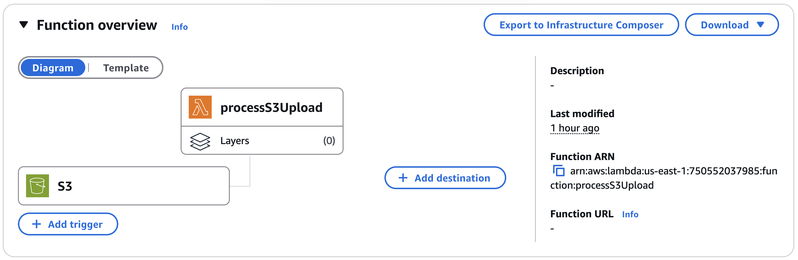

# ⋆˙⟡ 𓂃 Cloud-Based Document Submission System 𓂃 ࣪˖ ִֶָ  ☁️་༘   
- **By : Tatiya Seehatrakul st124875**
- This project is developed to fulfill the requirements of the AT83.03	Cloud Computing course at the Asian Institute of Technology (AIT) for the January 2025 semester.
---

## 📍 Project Overview
This project implements a secure, serverless document submission system using AWS services including Amazon S3, Lambda, SNS, DynamoDB, and Cognito. Users upload files via pre-signed URLs to an S3 bucket (doc-submission-bucket), triggering a Lambda function that extracts metadata, stores it in DynamoDB, and sends a notification via SNS. A web-based dashboard, hosted on S3 and authenticated with Cognito, visualizes uploaded file data in real time. The architecture follows AWS best practices for scalability, automation, and cost-efficiency.

  <br>
  <p align="left">
    
  </p>

---

## 📍 Step 1: Create an S3 Bucket

1. Navigate to **Amazon S3** in the AWS Management Console.
2. Click **Create bucket** and configure the following:
   - **Bucket name**: `doc-submission-bucket-yourname`
   - **Region**: Same as the region where your Lambda functions will be deployed
   - **Block Public Access**: ✅ Enabled (recommended)
   - **Versioning**: Optional
   - Leave all other settings as default

    <br>
    <p align="left">
      
    </p>


---

## 📍 Step 2: Create Lambda Functions

### 1. `generatePresignedURL`
- **Runtime**: Python 3.12  
- **Purpose**: Generates a pre-signed URL to securely upload files to S3.
  <br>
  <p align="left">
  
  </p>

### 2. `processS3Upload`
- **Runtime**: Python 3.12  
- **Purpose**: Triggered when a new file is uploaded. It sends an email notification and stores metadata into DynamoDB.

#### ➕ Add S3 Trigger to `processS3Upload` Lambda
1. Navigate to the **Configuration > Triggers** tab of the Lambda function.
2. Click **Add trigger** and select:
   - **Trigger**: S3
   - **Bucket**: `doc-submission-bucket-yourname`
   - **Event type**: `PUT (Object Created)`
   - **Prefix (optional)**: `demo-user/`
   - **Suffix (optional)**: `.pdf`
3. Acknowledge the permissions warning and click **Add**.
    <br>
    <p align="left">
    
    </p>

---

## 🔐 IAM Roles and Permissions for Lambda

### For `generatePresignedURL` Lambda Role

Inline Policy: `AllowUploadToDemoUserFolder`

```json
{
  "Version": "2012-10-17",
  "Statement": [
    {
      "Sid": "AllowUploadToDemoUserFolder",
      "Effect": "Allow",
      "Action": "s3:PutObject",
      "Resource": "arn:aws:s3:::doc-submission-bucket/demo-user/*"
    }
  ]
}
```

### For `processS3Upload` Lambda Role

Inline Policy: `S3UploadPermissions-SNS-DynamoDB`
> Replace `YOUR_ACCOUNT_ID` with your actual AWS Account ID.

```json
{
    "Version": "2012-10-17",
    "Statement": [
        {
            "Effect": "Allow",
            "Action": [
                "sns:Publish"
            ],
            "Resource": "arn:aws:sns:us-east-1:033321897760:FileUploadNotifications"
        },
        {
            "Effect": "Allow",
            "Action": [
                "dynamodb:PutItem"
            ],
            "Resource": "arn:aws:dynamodb:us-east-1:*:table/FileMetadata"
        }
    ]
}
```


Inline Policy: `AllowPublishToSNS`

```json
{
  "Version": "2012-10-17",
  "Statement": [
    {
      "Effect": "Allow",
      "Action": "sns:Publish",
      "Resource": "arn:aws:sns:us-east-1:750552037985:FileUploadNotifications"
    }
  ]
}
```
---

## 📍 Step 3: Create an SNS Topic and Email Subscription

1. Go to **Amazon SNS > Topics** in the AWS Console.
2. Click **Create topic** and choose the following:
   - **Type**: Standard
   - **Name**: `FileUploadNotifications`
3. After the topic is created, click **Create subscription**:
   - **Protocol**: Email
   - **Endpoint**: Your email address
4. Confirm the subscription via the confirmation email.
5. Copy the **Topic ARN** for later use in your Lambda function.

    <br>
    <p align="left">
    
    <br>
    
    </p>
---

## 📍 Step 4: Create DynamoDB Table

1. Navigate to **Amazon DynamoDB > Tables**.
2. Click **Create table** and configure:
   - **Table name**: `FileMetadata`
   - **Primary key**: `file_key` (String)
3. Leave all other settings as default.

    <br>
    <p align="left">
    
    </p>
---

## 📍 Step 5: Build a DynamoDB-Powered Web Dashboard Hosted on S3

A static web dashboard (hosted on Amazon S3) that:
- Fetches data from the `FileMetadata` DynamoDB table
- Uses Amazon Cognito to provide unauthenticated guest access
- Displays metadata in a dynamic table and bar chart

### 1. Set Up Cognito Identity Pool
1. Navigate to **Amazon Cognito > Identity Pools**.
2. Click **Create new identity pool**:
   - **Name**: `FileDashboardPool`
   - ✅ Enable guest access (unauthenticated access only)
3. Click **Next**, then create new IAM roles (e.g., `IdentityPoolRole`)
4. Save your **Identity Pool ID** for use in the dashboard
    <br>
    <p align="left">
    
    </p>

### 2. Update IAM Role for DynamoDB Access

1. Go to **IAM > Roles**
2. Select the unauthenticated role (e.g., `Cognito_FileDashboardPoolUnauth_Role`)
3. Click **Add inline policy** → switch to the **JSON** tab
4. Paste the following:

```json
{
  "Version": "2012-10-17",
  "Statement": [
    {
      "Effect": "Allow",
      "Action": [
        "dynamodb:Scan"
      ],
      "Resource": "arn:aws:dynamodb:us-east-1:*:table/FileMetadata"
    }
  ]
}
```

### 3. Prepare the HTML/JavaScript Dashboard

The dashboard:
- Uses Cognito credentials
- Calls DynamoDB via the AWS SDK
- Renders a table and bar chart with Chart.js

The file name should be `index.html`.

### 4. Host the Dashboard on Amazon S3

1. Go to **Amazon S3 > Create bucket**:
   - **Bucket name**: `file-dashboard`
   - Enable **ACLs** (optional depending on version)
   - Disable **Block all public access**
2. Upload `index.html` to the bucket
3. Go to the **Properties** tab → Enable **Static Website Hosting**:
   - **Index document**: `index.html`
4. Make the file public
    <br>
    <p align="left">
      
      <br>
      
    </p>

### 5. Add Bucket Policy to Allow Public Access
Go to **Permissions > Bucket Policy**, and paste:

```json
{
  "Version": "2012-10-17",
  "Statement": [
    {
      "Sid": "PublicReadForWebsite",
      "Effect": "Allow",
      "Principal": "*",
      "Action": "s3:GetObject",
      "Resource": "arn:aws:s3:::file-dashboard/*"
    }
  ]
}
```

Replace `file-dashboard` with your actual bucket name.

### 6. Test the Dashboard

1. Open the S3 static website URL (e.g., `https://file-dashboard.s3.amazonaws.com/index.html`)
2. The dashboard should:
   - Fetch data from DynamoDB
   - Render a table and a bar chart with file metadata

---

## ✅ End-to-End File Upload Test

Use `curl` to upload a file using the pre-signed URL:

```bash
curl -X PUT "<presigned_url>" \
  --upload-file "path_to_file"
```

### Example:
```bash
curl -X PUT "https://doc-submission-bucket.s3.amazonaws.com/demo-user/sample.pdf?..." \
  --upload-file "$HOME/Downloads/ADA_Assignment_3.pdf"
```
  <br>
  <p align="left">
    
  </p>

---

## 📍 Expected Output
- ✅ Uploaded files stored in `doc-submission-bucket` S3 bucket.
  <br>
  <p align="left">
    
  </p>

- ✅ SNS sends an email notification to the subscribed email address upon file upload.
  <br>
  <p align="left">
    
  </p>

- ✅ Metadata related to the uploaded file (e.g., file key, uploader, timestamp) is saved in the `FileMetadata` DynamoDB table.
  <br>
  <p align="left">
    
  </p>

- ✅ The S3-hosted dashboard fetches and displays the metadata from DynamoDB in a dynamic HTML table and bar chart.
  <br>
  <p align="left">
    
    <br>
      
  </p>

- ✅ The `processS3Upload` Lambda function logs execution details to Amazon CloudWatch for monitoring and debugging.

---

## 📍 Security Considerations

- All uploads are secured using time-limited pre-signed URLs
- IAM policies are scoped to limit actions and resources
- Public access is restricted to static dashboard assets only
